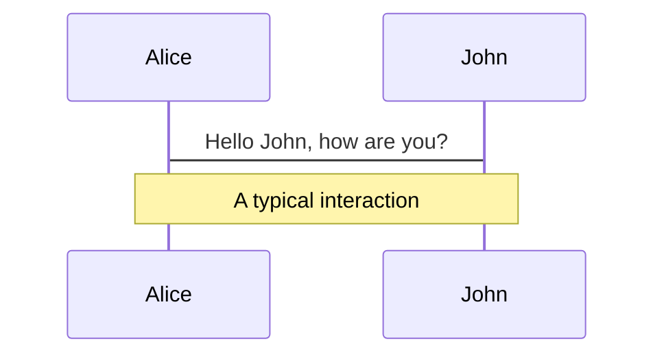
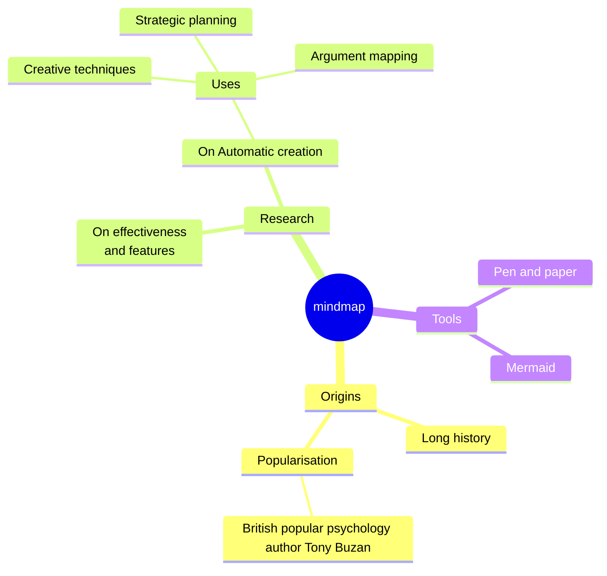
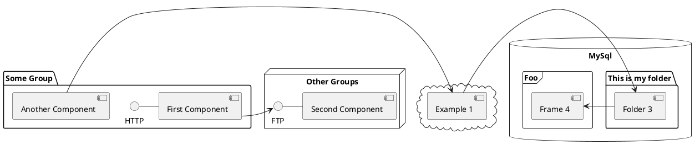

---
# try also 'default' to start simple
theme: seriph
# random image from a curated Unsplash collection by Anthony
# like them? see https://unsplash.com/collections/94734566/slidev
# background: https://cover.sli.dev
background: https://res.cloudinary.com/drnqdd87d/image/upload/f_auto,q_auto/background_slide
# some information about your slides, markdown enabled
title: Future-Proofing Your Career - NexaScale Community Townhall Meeting
info: |
  ## Future-Proofing Your Career - Skills and Mindsets for Success in Tomorrow's World.
  Learn more at me [Sli.dev](https://oluwasetemi.dev)
# apply any unocss classes to the current slide
class: text-center
# https://sli.dev/custom/highlighters.html
highlighter: shiki
# https://sli.dev/guide/drawing
drawings:
  persist: false
# slide transition: https://sli.dev/guide/animations#slide-transitions
transition: slide-left
# enable MDC Syntax: https://sli.dev/guide/syntax#mdc-syntax
mdc: true
---

# Future Proofing Your Career: Skills and Mindsets for Success in Tomorrow's World

`Oluwasetemi Ojo`

<!-- <div class="pt-12">
  <span @click="$slidev.nav.next" class="px-2 py-1 rounded cursor-pointer" hover="bg-white bg-opacity-10">
    Press Space for next page <carbon:arrow-right class="inline"/>
  </span>
</div> -->

<div class="abs-br m-6 flex gap-2">
  <a href="https://github.com/Oluwasetemi/future-proof-your-career-nexascale" target="_blank" alt="GitHub" title="Open in GitHub"
    class="text-xl slidev-icon-btn opacity-50 !border-none !hover:text-white">
    <carbon-logo-github />
  </a>
</div>

---

# Who am I?

Just another randomly generated form of artwork on a Journey

<div v-click></div>

- 🛠 **FullStack Software Engineer** - <a href="https://app.fluna.co">@fluna.co</a>
- 📝 **Instructor** - <a href="https://altschoolafrica.com/">@altSchoolAfrica</a> (trained over 5000 developers)
- 🧑‍💻 **Youtuber** -  <a href="youtube.com/@setemiojo" target="_blank" alt="Youtube" title="Open in Youtube"
    class="text-xl slidev-icon-btn opacity-50 !border-none !hover:text-white">
    <carbon-logo-youtube />
  </a> <a href="youtube.com/@setemiojo">teaching, live coding and latest web technologies</a>
- 🤹 **Husband** - of <a href="https://www.instagram.com/beaglo_official">@Temidayo</a>
- 👪 **Father** - doing fathering with Temidayo and Baby Esther
- ⚽🏀 **Sport Fan** - Manchester United, Shooting Stars (3SC) and Golden State Warriors
- 📝 **Fake Writer** - <a href="oluwasetemi.dev/blog">oluwasetemi.dev/blog</a>, <a href="https://medium.com/@setemiojo">medium</a>, <a href="https://hashnode.com/@setemiojo">hashnode</a>

<br>
<br>

Read more about [Oluwasetemi?](https://oluwasetemi.dev/about)

<!--
You can have `style` tag in markdown to override the style for the current page.
Learn more: https://sli.dev/guide/syntax#embedded-styles
-->

<style>
h1 {
  background-color: #2B90B6;
  background-image: linear-gradient(45deg, #4EC5D4 10%, #146b8c 20%);
  background-size: 100%;
  -webkit-background-clip: text;
  -moz-background-clip: text;
  -webkit-text-fill-color: transparent;
  -moz-text-fill-color: transparent;
  text-align: center;
}
</style>

<!--
Here is another comment.
-->

---

# Expectations

<!-- https://sli.dev/guide/animations.html#click-animations -->
<!-- 
<p v-after class="absolute bottom-23 left-45 opacity-30 transform -rotate-10">Here!</p> -->

- Not a workshop, you can invite me for technical workshops
- No coding will be done, but I do write & teach code for living
- No prerequisite is needed, just hope to shift you mindset and transform your career with helpful ideas

---

# Table of contents

1. Learning How To Learn
2. Searching For The Best Resources
3. Motivation and Discipline
4. Quality Building and Practice
5. Dare to Go Global with a reputation
6. Understand the Trends
7. Some soft skills and Technical skills

<!-- <Toc/> -->

---

# Learning How To Learn

It is a first principle thing to grasp the concept of learning, not only will it be useful in your career but it will help you in every phase of life.

Learning how to learn is a life long learning journey, it involves you grasping the <span v-mark.underline.red>concepts of deconstruction</span> and <span v-mark.underline.pink>recombination of Knowledge</span>. It requires having the super power of figuring things out, maybe a childlike wonder. A child will always wonder at everything and in curiosity want to know the mystery behind the operations of anything they come in contact with.

It is the courage to take on a piece of information and distill it till you are able to reproduce it in several format.

<!-- Use code snippets and get the highlighting directly, and even types hover![^1]

```ts {all|5|7|7-8|10|all} twoslash
// TwoSlash enables TypeScript hover information
// and errors in markdown code blocks
// More at https://shiki.style/packages/twoslash

import { computed, ref } from 'vue'

const count = ref(0)
const doubled = computed(() => count.value * 2)

doubled.value = 2
```

<arrow v-click="[4, 5]" x1="350" y1="310" x2="195" y2="334" color="#953" width="2" arrowSize="1" />

<!-- This allow you to embed external code blocks -->
<!-- <<< @/snippets/external.ts#snippet -->

<!-- Footer -->

<!-- Inline style -->
<style>
.footnotes-sep {
  @apply mt-5 opacity-10;
}
.footnotes {
  @apply text-sm opacity-75;
}
.footnote-backref {
  display: none;
}
</style>

<!--
Notes can also sync with clicks

[click] This will be highlighted after the first click

[click] Highlighted with `count = ref(0)`

[click:3] Last click (skip two clicks)
-->

---

# Searching For The Best Resources

<br />

<p v-click>A very successful famous Silicon valley investor, Naval shares his opinions that - if you are the best mathematics teacher in the world then you should be teaching the world mathematics. It means that if you want to get so good at this coding career you must look for the best resources out there with good explanation and high bar for excellence.</p>

<br />
<br />

<p v-click="2">A final destination for high quality content is Open Source, contibution and looking through codebase on GitHub will expose you to how mad some people can write amazing software. The world is more open than ever.</p>

<br />
<br />
<p v-click="3">Pay for courses too</p>

---

# Motivation and Discipline

<div grid="~ cols-2 gap-4">
<div>

Motivation

> People can help you in many ways throughout life, but there are two things nobody can give you: curiosity and drive. They must be self-supplied.
>

- You are the pilot of your destiny
- Sapa
- Situation
- Whatever your reason, stay motivated

</div>
<div>

Discipline

> If you said you will do something, then show up and do it.
>

<br />

<div style="width:100%;height:0;padding-bottom:56%;position:relative;"><iframe src="https://giphy.com/embed/Vu2ew98mO1kZi" width="100%" height="100%" style="position:absolute" frameBorder="0" class="giphy-embed" allowFullScreen></iframe></div><p><a href="https://giphy.com/gifs/disney-mulan-walt-disney-animation-studios-shang-Vu2ew98mO1kZi"></a></p>

</div>
</div>

<p>Living a purpose driven life will always be a source of drive and a deep reason for your WHY. It reminds me of books like START WITH WHY by Simon Sinek, Drive by David Pink and the famous Atomic Habits by James Clear.</p>

<!--
Presenter note with **bold**, *italic*, and ~~striked~~ text.

Also, HTML elements are valid:
<div class="flex w-full">
  <span style="flex-grow: 1;">Left content</span>
  <span>Right content</span>
</div>
-->

---

# Bonus on Purpose - IKIGAI

<p>Passion, Mission, Profession, Vocation. What you are GOOD at, What you love, What the world needs, What you can be paid for</p>

<div class="sample" ><iframe src="https://giphy.com/embed/n8IMxcRni1kRbXDhnS" width="480" height="380" frameBorder="0" class="giphy-embed flex" allowFullScreen></iframe></div>

<style>
  div.sample {
    display: flex;
    place-content: center;
  }
</style>

---

# Quality Building and Practice

<div v-click />

<v-click>
<span v-mark.underline.yellow="3">10000 hours</span>  <span v-mark.underline.purple="4">or 10000 iterations</span> <span v-mark.underline.white="5">to become a Master</span>
</v-click>

<br />
<br />

<div v-click="6">

</div>

<p v-click="7">Whatever your approach will be, only Quality work will stand the test of Time</p>
<span v-click="8" v-mark.circle.green="9">Real Gold they say fear no fire 🔥, you must put in the work to see results</span>

---

# Dare to Go Global with a reputation

- Know your life purpose
- Create a brand around the purpose
- Start contributing to Open Source - GitHub, Hugging face
- Attend Working Group/Committee meetings and follow a technology like your next job depends on it.
  - [Nodejs](https://github.com/nodejs/TSC/blob/main/WORKING_GROUPS.md)
  - [JavaScript TC-39](https://github.com/tc39)
  - Browser Engines Group, V8, Blink, WebKit
  - [HTML](https://whatwg.org/)
  - [CSS](https://www.w3.org/groups/wg/css/)
- Contribute and help build the next amazing tools e.g Chakra work by Segun Adebayo

---

# Motion

Ensure you are moving, No days off by Temi and Twice As Tall by Burna

<div grid="~ cols-2 gap-4">
<div>

> If you're feeling like you can't level up
>
> Omo make you no stop at all
>
> Because right when you start feeling like you can't level up
>
> That's when you haffi shut the devil up
>
> Oh, I'd have to be twice as tall
>
> Oh, I'd have to be thrice as wide
>
> You have to fight (yeah, ay, eee, eee)
>
> -- Burna Boy

</div>
<div>

> I've been shooting hoops on the court with no days off
>
> And, you know, I put my life on the line and it paid off
>
> -- Teni

</div>
</div>

<div class="w-60 relative">
  <div class="relative w-40 h-40">
    <span
      v-motion
      :initial="{ x: 800, y: -200, scale: 1.5, rotate: -50 }"
      :enter="final"
      class="mt-5 absolute inset-0"
      alt=""
    >Motion</span>

  </div>

  <div
    class="text-5xl absolute top-14 left-40 text-[#2B90B6] -z-1"
    v-motion
    :initial="{ x: -80, opacity: 0}"
    :enter="{ x: 0, opacity: 1, transition: { delay: 2000, duration: 1000 } }">
    No days off
  </div>
  <div
    class="text-5xl absolute top-14 left-80 text-[#2B90B6] -z-1"
    v-motion
    :initial="{ x: -80, opacity: 0}"
    :enter="{ x: 0, opacity: 1, transition: { delay: 2000, duration: 1000 } }">
    Twice as Tall
  </div>
</div>

<!-- vue script setup scripts can be directly used in markdown, and will only affects current page -->
<script setup lang="ts">
const final = {
  x: 0,
  y: 0,
  rotate: 0,
  scale: 1,
  transition: {
    type: 'spring',
    damping: 10,
    stiffness: 20,
    mass: 2
  }
}
</script>

---

# A formula to make it

<br>

Do you really want to make it?
$$ {1|all}
\begin{array}{c}

\nabla \times \vec{\mathbf{B}} -\, \frac1c\, \frac{\partial\vec{\mathbf{E}}}{\partial t} &
\times \frac{4\pi}{c}\vec{\mathbf{j}}    \nabla \cdot \vec{\mathbf{E}} & \times & 4 \pi \rho \times \sqrt{3x-1}+(1+x)^2 \\

\end{array}
$$

<br>

<p v-click>Stop looking for Shortcuts, </p>

---

# Understand the Trends

Understand the times and season in your life, career and tech space.

- the wind rush of AI is real, find a way to fit in.
- Standard is high
- Stop wanting to be the friend of the Unicodeveloper, Adora, Hacksultan and co build up your circle
- Rise of fall of programming language and technologies e.g React and JavaScript
- Know your tools and the every new features

---

# Some soft skills and Technical skills

---
> "The producer of old age is habit: the deathly process of doing the same thing in the same way at the same hour day after day, first from carelessness, then from inclination, at last from cowardice or inertia.

> Habit is necessary; but it is the habit of having careless habits, of turning a trail into a rut, that must be incessantly fought against if one is to remain alive... one can remain alive long past the usual date of disintegration if one is unafraid of change, insatiable in intellectual curiosity, interested in big things, and happy in small ways."
>
> -- Edith Wharton
---

# Shoutout

Thank you to NexaScale team for the opportunity Ore, Jennifer, Adora, Fatimah, Busayo and others.
I admire Adora and her work in the tech community. Thank you taking the conversation global and Congratulations on the new challenge.

<div class="mt-5" v-click>
  🙌💥Special thank you to Jennifer💥🙌
</div>

<p class="mt-5" v-click="2">
  🎆Special thank you to Everyone who is working hard out of Africa, understanding the odds seems not to be in our favour but we are changing the narratives🎆
</p>

<!-- <div class="grid grid-cols-4 gap-5 pt-4 -mb-6">



```mermaid {theme: 'neutral', scale: 0.8}
graph TD
B[Text] -> C{Decision}
C ->|One| D[Result 1]
C ->|Two| E[Result 2]
```





</div> -->

<!-- ```ts {monaco}
import { ref } from 'vue'
import { emptyArray } from './external'

const arr = ref(emptyArray(10))
``` -->

<!-- ```ts {monaco-run}
import { version } from 'vue'
import { emptyArray, sayHello } from './external'

sayHello()
console.log(`vue ${version}`)
console.log(emptyArray<number>(10).reduce(fib => [...fib, fib.at(-1)! + fib.at(-2)!], [1, 1]))
``` -->
---

# The End

## Questions

<br/>

### Wishing you all the best
